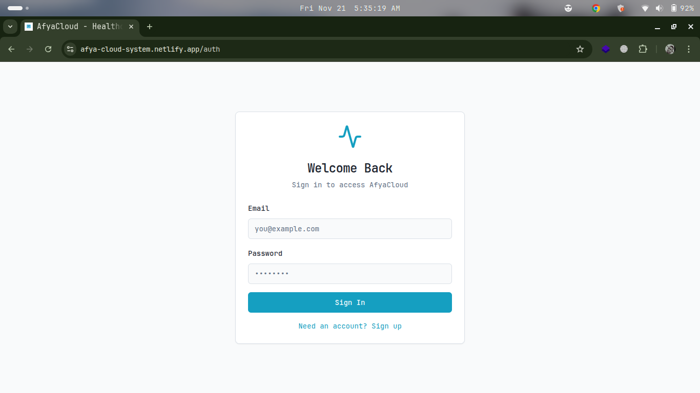
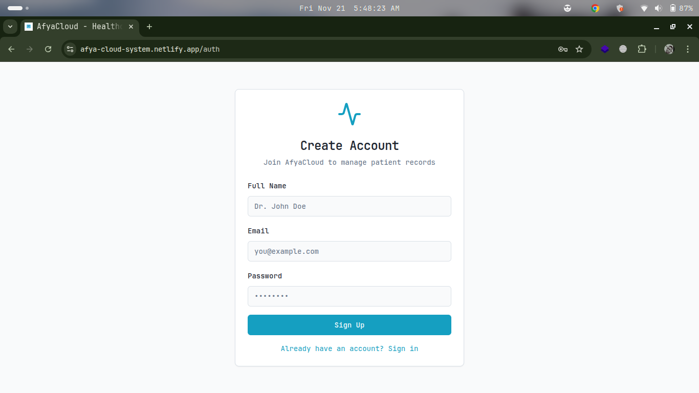
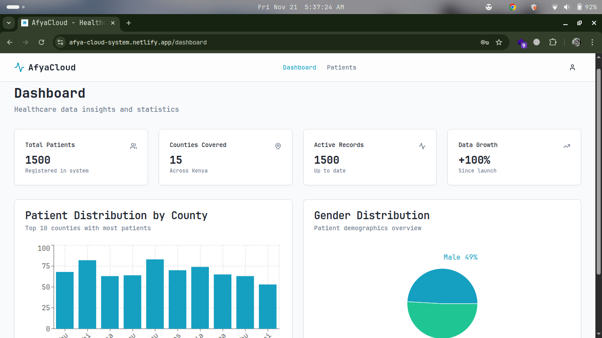
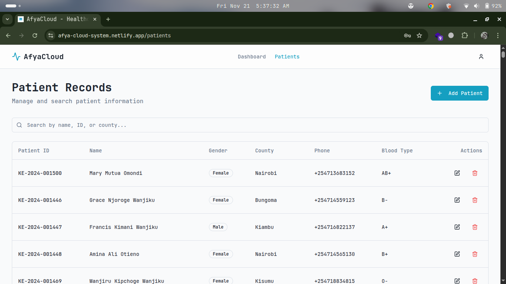

# AfyaCloud — Fast, Reliable Health Data Platform

> **Empowering healthcare systems with cloud-enabled, offline-first patient data management.**  
> Built with the **MERN Stack** to support **UN SDG 3 — Good Health and Well-being.**

---

## Overview

**AfyaCloud** is a full-stack MERN application that provides a reliable, cloud-based solution for **storing, syncing, and analyzing patient data** across healthcare facilities in Kenya — regardless of internet connectivity.

It’s built to solve critical healthcare data challenges:

- Poor connectivity in rural hospitals  
- Loss or misuse of medical devices  
- Inefficient, outdated EMR systems  
- Data delays affecting patient care

AfyaCloud ensures **secure**, **real-time**, and **interoperable** health data management — even in low-resource settings.

## Live Demo  

[Click here to view the live app](https://afya-cloud-system.netlify.app/)

---

## Screenshots  

### Authentication  

  
  

### Admin Dashboard  

  

### Patient page

  

---

## Tech Stack  

*Frontend*:  

- React  
- TailwindCSS  
- Axios  
- React Router  
- React Toastify  
- Socket.io-client  

*Backend*:  

- Node.js + Express  
- pgsql # soon to migrate that to MongoDB
- JWT Authentication  
- Socket.io  

*Deployment*:  

- Frontend → Netlify  
- Backend → Render  

---

## Core Features

| Feature | Description |
|----------|--------------|
| **Offline-First Access** | Data stored locally via IndexedDB/SQLite and auto-synced when online. |
| **Cloud Sync API** | RESTful APIs built with Express.js and MongoDB Atlas. |
| **Secure Compression** | Protects patient data while minimizing bandwidth usage. |
| **Analytics Dashboard** | Real-time insights into system performance and patient care. |
| **Device Tracking** | Monitors usage and accountability for hospital devices. |
| **User-Friendly Interface** | Responsive design built with React.js + Tailwind CSS. |

---

## Tech Stack

| Layer | Technology |
|-------|-------------|
| Frontend | React.js, Vite, Tailwind CSS |
| Backend | Node.js, Express.js |
| Database | MongoDB Atlas (Mongoose ORM) |
| Authentication | JWT / OAuth2 |
| Offline Storage | IndexedDB / SQLite |
| Hosting | Render / Vercel / Netlify |
| Version Control | Git & GitHub |

---

## Project Setup (For Developers)

### Prerequisites
Make sure you have:
- Node.js (v18+)
- MongoDB Atlas account or local MongoDB
- Git installed
- Code editor (VS Code recommended)

---

### Installation Steps

1. **Clone the repository**
   ```bash
   git clone https://github.com/codewin1/afyacloud.git
   cd afyacloud
   ```

2. **Install dependencies**
     ```bash
     npm install
     npm run dev
     
     ```
     or
     ```
     navigate to the [live app](https://afya-cloud-system.netlify.app/)
     to access the site easily.
     create an account
     ```
3. **Create an `.env` file** inside the `/server` folder:
   ```env
   MONGO_URI=your_mongodb_connection_string
   JWT_SECRET=your_secret_key
   PORT=5000
   ```

4. Visit the frontend app:
   ```
   http://localhost:5000
   ```

---

## API Overview

| Method | Endpoint | Description |
|--------|-----------|-------------|
| `POST` | `/api/patients` | Add new patient record |
| `GET` | `/api/patients` | Fetch all patients |
| `PUT` | `/api/patients/:id` | Update patient data |
| `DELETE` | `/api/patients/:id` | Delete patient record |
| `GET` | `/api/analytics` | Fetch dashboard data |
| `POST` | `/api/auth/login` | Authenticate user |

Test endpoints easily using **Postman** or **Thunder Client**.

---

## SDG 3 — Good Health & Well-being

AfyaCloud supports the **United Nations Sustainable Development Goal 3** by:
- Enabling **efficient health data access** across counties.  
- Reducing errors caused by data backlog or device loss.  
- Empowering **health workers** through reliable digital tools.  
- Promoting **interoperability** between hospitals and national health databases.  

---

## Roadmap

| Stage | Goal | Target |
|--------|------|--------|
| MVP | Core platform with patient data & device tracking | Q1 2026 |
| Pilot | Kirinyaga Level 5 Hospital rollout | Q2 2026 |
| Beta | Expansion to 3 counties | Q3 2026 |
| Scale | National integration and AI analytics | 2027 |

---

## Business Model

AfyaCloud follows a **tiered SaaS model**:
- **Free tier** for small clinics  
- **Pro tier** for hospitals and health centers  
- **Enterprise tier** for NGOs, health agencies, and data systems  

Add-ons include:
- Custom APIs  
- Advanced analytics dashboards  
- Secure reporting tools

---

## Contributing

Contributions are welcome!  
1. Fork the project  
2. Create your feature branch: `git checkout -b feature/amazing-feature`  
3. Commit your changes: `git commit -m 'Add amazing feature'`  
4. Push to the branch: `git push origin feature/amazing-feature`  
5. Open a Pull Request  

---

## License

This project is licensed under the **MIT License** — feel free to use and modify it with proper credit.

---

## Author

** Edwin Murimi**  
Founder & Lead Developer – AfyaCloud

 contact@afyacloud.co.ke  

 [LinkedIn](https://linkedin.com/in/murimiedwin) |[www.afyacloud.com](https://www.afyacloud.com)

---

## Acknowledgments

Special thanks to:
- The Power Learn Project community  
- Kenyan healthcare professionals contributing to digital health adoption  
- Mentors and peers supporting innovation toward **SDG 3: Good Health and Well-being**

---

> **AfyaCloud** — *Transforming Healthcare, One Patient Record at a Time.*